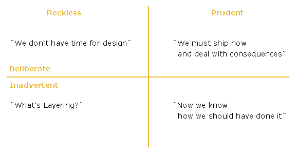
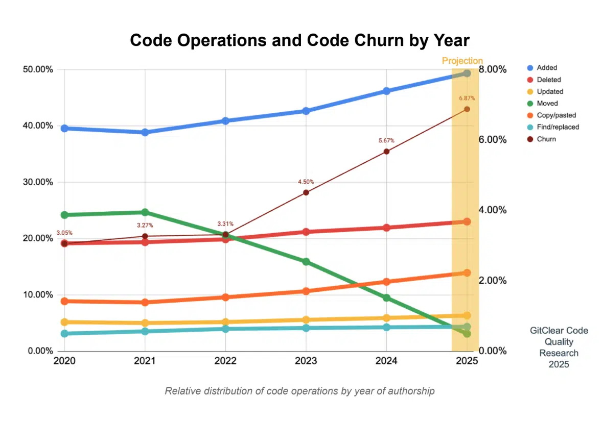

# Clean Code Developement

Inhaltsverzeichnis

**1. Was versteht man unter Clean Code ?**

**2. Was versteht man unter technical debt und wie denken Manager und Entwickler darüber ?**

**3. Motivation Clean Code anzuwenden**

**4. Grundlegende Prinzipien der Programmierung**

**5. Best practices für Clean Code und Beispiele**

**6. Clean Code und Generative KI**

**7. Fazit**

## 1. Was versteht man unter Clean Code ?

**Clean Code** ist der verantwortungsvolle Umgang mit Code, der als Gestaltung von gutem Code beziehungsweise guter Software zu verstehen ist.
Hierbei ist nicht nur der Code an sich relevant, sondern auch die Architektur und der gesamte Aufbau des Softwareprojektes.

## 2. Was versteht man unter technical debt und wie denken Manager und Entwickler darüber ?

**Technical debt** bezeichnet die Gefahr, die Probleme und die Folgen, welche aus schlecht geschriebenen Code entstehen.

- Manager, Unternehmen und Entwickler sind sich der Bedeutung eines hohen technical debt (technische Schuld) nicht bewusst.

### Manager

- durch den Lock-In-Effekt sind Kunden 10 Jahre oder länger an das Produkt gebunden.

Daher werden Entscheidungen auf Grund von folgender Einordnung gegen gutes Design getroffen.




    Reckless (rücksichtslos / unverantwortlich)
    Prudent (vernünftig / besonnen)
    Deliberate (absichtlich / bewusst)
    Inadvertent (unbeabsichtigt / ungewollt)

- schnelles Geld verdienen und bewusst rücksichtslos sein
- Unwissende, die Qualität, Codequalität, Design und technical debt nicht verstehen
- der Gefahr von technical debt nicht bewusst sein und das Problem verschieben
- Qualität ist von Anfang an im Blick und Fehler werden erkannt, _aber_ es wird gehofft später die Zeit dafür zu finden.

### Entwickler

Entwickler arbeiten jedoch mit dem folgenden Wissen:

- sie müssen Manager erst davon überzeugen, dass ein geringer technical debt ein Vorteil ist
- das Wissen, dass Code zu 90% gelesen wird und nicht nur von einer Person
- das Wissen, dass die Wartung von Code und die Erweiterung mehr als die Gesamtkosten von Software ausmachen

## 3. Motivation Clean Code anzuwenden

### Das Ziel von Clean Code

Das Ziel ist die **Entwicklung von guten, veränderbaren, nachhaltigen und lesbaren Code** durch die Umsetzung von **Best Practices, Coding Guidelines** und Regeln.
Aber auch die Entwickler zu ermutigen, durch die Anwendung von Clean Code den **Code so zu entwickeln**, dass dessen **Qualität so gut ist**, dass der **technical debt minimal** bleibt.

Das Ziel ist ein gutes Design statt kein Design

### Die Motivation Clean Code anzuwenden

Jeder kennt das Problem von schlechten Code, aber keiner bekämpft es an der Wurzel, da das Wissen nicht kohärent, sondern selektiv existiert.

Die Probleme sind dabei folgende:

- die **Unwissenheit der Entwickler**
- der **Marktdruck schnell "irgendetwas" zu liefern**
- die **Wartbarkeit, Lesbarkeit, Testbarkeit** und **Änderbarkeit** von Code nimmt zu

Dies macht den Code nicht mehr kontrollierbar und **80% der Gesamtkosten** sind für das **Debuggen** und die **Wartung**.

Der Aufwand für das Einführen neuer Features steigt.

Der Break-Even-Point, an dem es sich nicht mehr lohnt den technical debt zu erhöhen, weil man mit dem Produkt kein Geld mehr verdienen kann, ist schneller erreicht.

Die Vorteile & Nachteile von der Verwendung von gutem Design oder keinem Design sind Folgende:

kein Design:

- zu Beginn schneller mehr Funktionalitäten
- im weiteren Verlauf sinkt die Produktivität aufgrund schlechter Wartbarkeit
- der Aufwand für neue Features steigt
- die Projekte scheitern dadurch

gutes Design:

- zu Beginn weniger Funktionalitäten
- die Produktivität bleibt erhalten
- neue Features können besser implementiert werden

### Dies gelingt durch Prinzipen die in Form von Best Practices und Smells, dem Wissen was passiert, wenn man die Prinzipen und Regeln nicht einhält, gelebt werden müssen.

## 4. Grundlegende Prinzipien der Programmierung

### Die bekanntesten Prinzipien unter Softwareentwicklern sind:

- DRY = Don't repeat yourself.
- KISS = Keep it simple, stupid.

Diese besagen folgendes:

- Copy and Paste sollte vermieden werden, da dies eine der häufigsten Fehlerquellen ist
- sowohl die Struktur als auch die Menge an Code ist einfach zu halten und sollte später erweiterbar sein

### Weitere Prinzipien sind:

- zu frühe Optimierungen vermeiden
- Doing vs. Calling Code
- konfigurierbare Daten auf hoher Ebene
- Vorsicht bei Konfigurationen
- versteckte zeitliche Kopplung vermeiden
- nicht willkürlich sein

## 5. Best practices für Clean Code und Beispiele

Im Folgenden werden Bestpractices und dazugehörige Smells für folgende Bereiche erläutert

- Programmierprinzipien
- Grundlagen
- Code Basics
- Architektur und Klassendesign
- Packages
- Produktivität
- Management

## Grundlagen

### Nutzlosen Code entfernen

**BP** = Wenn Code tatsächlich zur späteren Aufgabe gehört, wird dieser mit einem TODO() versehen und in die Backlogliste eingetragen.

**Smell** = Ungenutzer & zweckloser Code, der stehen bleibt, verringert die Code Coverage.

#### ❌ falsch – unnützer Code bleibt einfach stehen

```java
public class PriceCalculator {

    public double calculateTotal(double price, int quantity) {
        double total = price * quantity;

        // Geplante Rabattfunktion … irgendwann
        // private double applyDiscount(double total) {
        //     return total * 0.9;
        // }
        //
        // double discounted = applyDiscount(total); // aktuell nicht genutzt

        return total;
    }
}
```

#### ✔️ richtig - Code für spätere Aufgaben wird mit TODO gekennzeichnet

```java
public class PriceCalculator {

    public double calculateTotal(double price, int quantity) {
        double total = price * quantity;

        // TODO: Rabattfunktion implementieren (siehe Backlog)
        // Idee: applyDiscount(total) -> total * 0.9

        return total;
    }
}
```

### Nutzlose Kommentare entfernen

**BP** = Der Code sollte mindestens auf Paket- oder Klassenebene ausreichend dokumentiert sein.

Wobei es zwei Meinungen gibt:

- alles muss dokumentiert werden
- der Code muss klar lesbar geschrieben sein

**Smell** = Dies dient für den abstrakten Einstieg in den Quellcode.

#### ❌ falsch – ungenutzte Variablen und Methoden

```java
public class UserProcessor {

    public String processUser(String user) {
        int unusedValue = 42;  // Wird nie verwendet

        helper(); // Wird gar nichts tun

        return "Processing " + user;
    }

    private void helper() {
        // die Methodenvariable wird nicht genutzt
        String user = "test";
    }
}
```

#### ✔️ richtig - unnützer Code wird konsequent entfernt

```java
public class UserProcessor {

    public String processUser(String user) {
        return "Processing " + user;
    }
}
```

### Präzise Benennungen

**BP** = Es sollten selbsterklärende Namen verwendet werden, die nicht zu lang sind und es sollte eine konsistente Benennung beibehalten werden.

- Klasse: beschreibe die Art der Implementierung
- Methode: beschreibe was sie macht und niemals wie sie es macht
- Interface: beschreibe die Funktionalität die sie abstrahiert
- Nebenwirkungen: der Name muss die Nebenwirkung ausdrücken
- kein Typ/ kein Scope: dies muss im Namen stehen

**Smell** = Der Code sollte sich wie Prosa lesen.

#### ❌ Schlechter Code – unklare und irreführende Namen

```java
public class X1 {

    public void doStuff(int a) {
        if (a > 18) {
            System.out.println("OK");
        }
    }
}

interface D {
    void t();
}
```

#### ✔️ richtig - präzise, aussagekräftige und konsistente Namen

```java
public class AgeValidator {

    public void validateAdultAge(int age) {
        if (isAdult(age)) {
            System.out.println("Age is valid for adult requirements.");
        }
    }

    private boolean isAdult(int age) {
        return age >= 18;
    }
}

interface Notifier {
    void sendNotification();
}
```

### Magic Numbers vermeiden

**BP** = Es sollte genau deutlich gemacht werden, was die Zahlen bedeuten.

**Smell** = Es wird viel Zeit verloren, um Magic Numbers zu verstehen.

#### ❌ Schlechter Code – Bedeutung der Zahlen nicht erkennbar

```java
public class DiscountCalculator {

    public double calculate(double amount) {
        if (amount > 500) {
            return amount * 0.85; // ? Warum 0.85?
        }
        return amount;
    }
}
```

#### ✔️ richtig - Verwendung von Konstanten mit eindeutigen Namen

```java
public class DiscountCalculator {

    private static final double MIN_AMOUNT_FOR_DISCOUNT = 500.0;
    private static final double DISCOUNT_FACTOR = 0.85;

    public double calculate(double amount) {
        if (amount > MIN_AMOUNT_FOR_DISCOUNT) {
            return amount * DISCOUNT_FACTOR;
        }
        return amount;
    }
}
```

### Keine Seiteneffekte erzeugen

**BP** = Eine Funktion sollte keine Seiteneffekte erzeugen.

- andere Module verlassen sich auf Variablen, diese sollten nicht plötzlich negative Zahlen haben und für Fehler sorgen

#### ❌ Schlechter Code – Methode verändert unerwartet den Zustand

```java
public class AccountService {

    private double balance = 1000.0;

    public double getBalanceAndApplyFees() {
        // Seiteneffekt: Der Kontostand wird verändert,
        // obwohl der Methodenname nur "lesen" suggeriert
        balance = balance - 50.0; // Gebühr abziehen
        return balance;
    }

    public double getBalance() {
        return balance;
    }
}
```

### Felder sollen den Zustand definieren

**BP** = Felder sollten einen stabilen Zustand eines Objektes repräsentieren.

- durch lokale Variablen
- durch Extrahieren einer Klasse, die temporäre Zustände berechnet oder verwendet

#### ❌ Schlechter Code – Felder als temporäre Berechnungsvariablen

```java
public class OrderCalculator {

    // Diese Felder definieren keinen stabilen Objektzustand,
    // sie werden nur innerhalb von Methoden temporär genutzt
    private double netPrice;
    private double tax;
    private double total;

    public double calculateTotal(double amount, double taxRate) {
        netPrice = amount;
        tax = netPrice * taxRate;
        total = netPrice + tax;
        return total;
    }
}
```

- Felder werden nur als Zwischenwerte genutzt
- die Instanz hat nach Berechnungen einen „zufälligen“ Zustand
- Nebenläufigkeit / Parallelität wird schwierig und fehleranfällig
- von außen ist unklar, welche Werte gerade gültig sind

### Korrekte Behandlung von Exceptions verwenden

**BP** = Exceptions sollten folgendes beachten:

- so spezifisch wie möglich abgefangen werden
- auf einer Ebene sein, auf der man sinvoll damit umgehen kann
- sauber verarbeitet werden
- nicht für den normalen Kontrollfluss verwendet werden

#### ❌ Schlechter Code – zu allgemeines Catch, schlechtes Handling

```java
public class FileReaderService {

    public String readConfig(String path) {
        try {
            // Alles Mögliche kann hier schiefgehen
            java.nio.file.Path filePath = java.nio.file.Paths.get(path);
            return java.nio.file.Files.readString(filePath);
        } catch (Exception e) {
            // Alles wird geschluckt und mit null beantwortet
            // Fängt Exception viel zu allgemein
            // Keine Log-Ausgabe, kein Hinweis auf Fehlerursache
            // null als Rückgabewert → Folgefehler an anderer Stelle
            // Keine differenzierte Reaktion auf unterschiedliche Fehlerarten
            return null;
        }
    }
}
```

#### ✔️ Guter Code – spezifische Exceptions, sinnvolles Handling

```java
import java.io.IOException;
import java.nio.file.Files;
import java.nio.file.NoSuchFileException;
import java.nio.file.Path;
import java.nio.file.Paths;

public class FileReaderService {

    public String readConfig(String path) throws IOException {
        Path filePath = Paths.get(path);

        try {
            return Files.readString(filePath);
        } catch (NoSuchFileException e) {
            // Spezifische Behandlung: Datei existiert nicht
            // sinnvolle Log-Nachricht oder alternative Rückgabe
            throw new IOException("Config file not found: " + path, e);
        } catch (IOException e) {
            // Andere I/O-Fehler
            throw new IOException("Error reading config file: " + path, e);
        }
    }
}
```

### Duplizierten Code vermeiden

**BP** = DRY steht für "Don't repeat yourself" und bedeutet, dass man selbst geschrieben Code nicht wiederholen sollte.

**Smell** = Dies bläht die Codebasis auf und sorgt für erhöhten Wartungsaufwand und Inkonsistenz. Es wird ebenfalls die Verständlichkeit verschlechtert und macht Fehler wahrscheinlicher.

#### ❌ Schlechter Code – Duplizierte Logik

```java
public class UserService {

    public void createAdminUser(String username, String password) {
        if (username == null || username.isBlank()) {
            throw new IllegalArgumentException("Username required");
        }
        if (password == null || password.length() < 8) {
            throw new IllegalArgumentException("Password too short");
        }

        // weitere Validierungen ...

        User user = new User(username, password);
        user.setRole("ADMIN");
        saveToDatabase(user);
    }

    public void createStandardUser(String username, String password) {
        if (username == null || username.isBlank()) {
            throw new IllegalArgumentException("Username required");
        }
        if (password == null || password.length() < 8) {
            throw new IllegalArgumentException("Password too short");
        }

        // dieselben Validierungen nochmal …

        User user = new User(username, password);
        user.setRole("USER");
        saveToDatabase(user);
    }

    private void saveToDatabase(User user) {
        // Speichern ...
    }
}
```

#### ✔️ Guter Code – Logik zentralisieren

```java
public class UserService {

    public void createAdminUser(String username, String password) {
        User user = createUser(username, password, "ADMIN");
        saveToDatabase(user);
    }

    public void createStandardUser(String username, String password) {
        User user = createUser(username, password, "USER");
        saveToDatabase(user);
    }

    private User createUser(String username, String password, String role) {
        validateCredentials(username, password);
        User user = new User(username, password);
        user.setRole(role);
        return user;
    }

    private void validateCredentials(String username, String password) {
        if (username == null || username.isBlank()) {
            throw new IllegalArgumentException("Username required");
        }
        if (password == null || password.length() < 8) {
            throw new IllegalArgumentException("Password too short");
        }
        // weitere Validierungen ...
    }

    private void saveToDatabase(User user) {
        // Speichern ...
    }
}
```

### Refactoring

**BP** = Man sollte den Refactoring Katalog kennen und die entsprechenden Menüs in der IDE beherrschen.
-Beispiele: Extract Method, Extract Class, Rename, Inline etc.

## Code und dessen Qualität

### Lokale Deklarationen verwenden

**BP** = Es sollte dort deklariert werden, wo die Variable verwendet wird und eine Sammlungen von Deklarationen am Blockanfang vermieden werden.

### Selbsterklärende Variablen verwenden

**BP** = Es sollte eine ausreichende Anzahl an selbsterklärenden Variablen verwendet werden und nicht zu viele die überflüssig sind.

**Smell** = Dadurch sind die einzelnen Schritte verständlich, gut lesbar und besser wartbar

### Korrekte Verwendung von Verschachtelungen

**BP** = Verschachtelter Code sollte zunehmend spezifische Aufgaben übernehmen und auf höherer Ebene sollte die Abstraktion oder Wahrscheinlichkeit eines Aufrufes höher sein.

#### ❌ Schlechter Code – Unklare, tiefe Verschachtelung

```java
public class OrderProcessor {

    public void process(Order order) {
        if (order != null) {
            if (order.getItems() != null && !order.getItems().isEmpty()) {
                if (order.getCustomer() != null) {
                    if (order.getCustomer().isActive()) {
                        // eigentliche Logik irgendwo hier ...
                        System.out.println("Processing order " + order.getId());
                    } else {
                        System.out.println("Customer inactive");
                    }
                } else {
                    System.out.println("No customer");
                }
            } else {
                System.out.println("No items");
            }
        } else {
            System.out.println("Order is null");
        }
    }
}
```

#### ✔️ Bessere Strukturierung / Architektur

- Frühe Rückgaben (Early Return) nutzen, um tiefe Verschachtelungen zu verhindern.
- Guard Clauses verwenden, um ungültige Zustände sofort zu verlassen.
- Methoden extrahieren, um jede Methode auf ein einziges Abstraktionsniveau zu bringen.
- Komplexe Bedingungen in sprechende Methoden auslagern (z. B. isValidCustomer()).
- Objekte modellieren, die Entscheidungen übernehmen → Verantwortung verteilen.
- Strategie- oder State-Pattern nutzen, wenn verschiedene Fälle unterschiedliche Logiken erfordern.
- Polymorphie statt Kontrollstrukturen – die Objektstruktur entscheidet das Verhalten.
- Enums mit Verhalten (Enum Strategy) statt switch/case.
- Null-Checks vermeiden → Null Object Pattern.
- Verwendung von Optional zur Vereinfachung von Prüfungen.

### Multi-Thread Code trennen

**BP** = Multi- Thread Code sollte nicht mit normalem Code vermischt werden und ein Thread sollte in eine eigene Klasse gekapselt werden.

### Conditionals kapseln

**BP** = Es sollte geprüft werden, ob es sinnvoll ist komplexe Logik zu kapseln.

- komplexe Bedingungen (if-Bedingungen) sollten **gekapselt** werden – z. B. in eigene Methoden mit sprechenden Namen.

### Negative Bedingungen Vermeiden

**BP** = Es sollten negative Ausdrücke vermieden werden.

**Smell** = Der Code ist schwer zu lesen und zu verstehen.

#### ❌ Schlechter Code – doppelte Verneinungen

```java
public class AccessService {

    public boolean hasAccess(User user) {
        if (!user.isNotActive()) {
            if (!user.isBlocked()) {
                return true;
            }
        }
        return false;
    }
}
```

### Randbedingungen kapseln

**BP** = Randbedingungen für Schleifen usw. sollte man deutlich erkennbar machen und an einer Stelle gebündelt implementieren.

**Smell** = Dies erschwert unnötig das Refactoring.

#### ❌ Schlechter Code – doppelte Verneinungen

```java
public class PaginationService {

    public void printLastPage(List<String> items) {
        int pageSize = 10;

        int startIndex = items.size() - (items.size() % 10);
        if (startIndex == items.size()) {
            startIndex = items.size() - 10;
        }

        for (int i = startIndex; i < items.size(); i++) {
            System.out.println(items.get(i));
        }
    }
}
```

- 10 ist überall verteilt (Magic Number + Randbedingung)
- Start-/Endindex werden an mehreren Stellen neu „erfunden“
- Änderung der Seitenlänge → viele Stellen anpassen

### Architektur und Klassendesign

### stärkere Kopplung bei Vererbung als bei Instanzen

**BP** = Es sollte Besser instantiiert werden als zu vererben.

**Smell** = Dies erschwert die Testbarkeit und Austauschbarkeit von Komponenten.

### Single Responsibility Principle

**BP** = Eine Klasse bzw. Modul sollte genau eine Verantwortung haben.

**Smell** = Viele fachliche Abhängigkeiten durch unterschiedliche Aufgaben in einer Klasse machen die Änderungen komplex und fehleranfällig.

### einzelne Querschnittsaufgaben

**BP** = Eine fachliche Methode sollte nicht mit Querschnittsaufgaben wie Persistenz, Logging, Sicherheit und Monitoring zugemüllt werden.

### Tennung von Interfaces

**BP** = Die Abhängigkeiten von einem Interfaces sollte minimal sein und Interfaces sollten getrennt und gezielt zugeschnitten werden.

- besser kleines und stabiles Interface ableiten, welches verwendet werden kann

### Versteckte Informationen

**BP** = Klassen sollten nur das exponieren, was andere unbedingt wissen müssen, außer unsichtbare Attribute und interne Details sind ausdrücklich gewünscht.

### Inversion of Control

**BP** = Die Steuerung der Ablauflogik sollte umgedreht ablaufen.

- das Framework ruft die Komponente auf

### Dependency Injection

**BP** = Abhängigkeiten sollten von außen in die Klasse gegeben werden anstatt von der Klasse selbst erzeugt zu werden.

### Open Colsed Principle

**BP** = Komponenten sollten offen für Erweiterungen sein, aber geschlossen für Modifikationen.

### Einfaches und komplexes Refactoring

**BP** = Der Code sollte so umgestaltet werden, dass sein Verhalten unverändert bleibt indem er durch Tests abgesichert ist und
leicht Rückgängig zu machen ist.

### Alle Basic und Enterprise Patterns prüfen

- Strategy
- Factory
- Adapter
- Strukturpattern
- Kontrollfluss
- Aufteilung der komponenten
- DAtenbankzugriff

### Die Implementierung sollte den Entwurf wiederspiegeln

**BP** = Die Implementierung und der Entwurf wie UML-Diagramme oder DDD-Darstellungen dürfen nicht auseinander driften.

### Best-Practice am Beispiel der Orderstruktur des Frontends von FoodRescure

Die Frontend-Ordnerstruktur des FoodRescue-Projekts wendet u.a. folgende Clean Code Prinzipien an:

- **Separation of Concerns** (Trennung nach Verantwortlichkeiten),
- **Single Responsibility Principle** (jede Datei hat eine klare Aufgabe) und
- **Modularisierung** (Aufteilung in wiederverwendbare Module).

Diese Prinzipien zeigen sich durch die Aufteilung in `css/`, `img/` und `js/` Ordner, wobei jeder Ordner einen spezifischen Dateityp und Verantwortungsbereich abdeckt. Im `js/` Ordner wird die Modularisierung deutlich: Jede JavaScript-Datei (authActions, authMode, dashboard, dom, main, notifications) hat eine klar definierte Aufgabe, was die Lesbarkeit und Wartbarkeit erhöht und Code-Duplikation vermeidet.


## 6. Clean Code und Generative KI

Generative KI bietet diverse Anwendungsbereiche, um Clean Code Prinzipien systematisch umzusetzen:

**1. Kontinuierliche Code-Überwachung**
KI-gestützte Tools überwachen den Code in Echtzeit und identifizieren automatisch Verstöße gegen Clean Code Prinzipien

**2. Kontextbezogene Inline-Vorschläge**
Während des Entwicklungsprozesses erhalten Entwickler unmittelbare Verbesserungsvorschläge direkt in ihrer Entwicklungsumgebung

**3. Gezielte Code-Analyse auf Anfrage**
Bei Bedarf können detaillierte Analysen durchgeführt werden, die Code-Qualität, Wartbarkeit und potenzielle Problembereiche aufzeigen

**4. Automatisiertes Refactoring**
KI kann komplexe Refactoring-Aufgaben durchführen und dabei die Funktionalität bewahren, während die Code-Qualität verbessert wird

Dabei liegt die Vermutung nahe, dass die zunehmende Nutzung von KI zu einer Verbesserung der allgemeinen Code-Qualität beitragen würde. Jedoch scheint derzeit das Gegenteil der Fall zu sein, wie einige aktuelle Beobachtungen zeigen:

> "**_AI Doesn't Create Technical Debt — But It Can Supercharge It_**
>
> _AI won't wreck your codebase by itself, but if there's no strict oversight, it can accelerate technical debt at an insane pace. The key? Never accept AI-generated code blindly—keep solid review, architecture, and quality processes in place._"
>
> — Quelle: [Kodus.io - "How AI-Generated Code is messing with your Technical Debt"](https://kodus.io/en/ai-generated-code-is-messing-with-your-technical-debt/#:~:text=AI%20won't%20wreck%20your,and%20quality%20processes%20in%20place])


— Kodus.io - AI Copilot Code Quality

Die zentrale Erkenntnis der Artikels ist: KI erzeugt nicht per se technische Schulden, kann diese aber bei fehlender Kontrolle extrem beschleunigen. Der kritische Erfolgsfaktor liegt in der Überwachung und Kontrolle des erzeugten.

## 7. Fazit

### Clean Code ist mehr als eine Sammlung von Prinzipien und Empfehlungen.

Clan Code ist eine Arbeitskultur und ein Qualitätsversprechen an sich selbst und das Team, welches die Software langfristig weiterentwicklt.
Clean Code ist ein kontinuierlicher Prozess und eine berufliche Haltung.
Wobei sich jeder Schritt in richtung Qualität auszahlt und eine Investition in folgende Punkte ist.

- in stabiliere Produkte
- in gerinegre Kosten
- in bessere Wartbarkeit
- in höhere Zufriedenheit bei Nutzern und entwicklern
- in den Erfolg des Unternehmens

## Anhang

## Weitere BPs

## Packages

### Common Closure und Common Resue

- Packages bzw. eine Klasse sollte so gestaltet werden, dass sie nicht geändert werden muss, aber erweritert werden kann
- Klassen die gemeinsam geändert oder gemeinsam wiederverwendet werden, gehören in das selbe Package

### Visualisierung von Paketabhängigkeiten

- Packages sollten nur nach rechts oder unten zugreifen, aber nie nach oben oder links.

### Paketabhängigkeiten müssen Zyklusfrei sein

- bereits wenige Zyklen reduzieren die Wandelbarkeit und Evolierbarkeit großer Softwaresysteme dramatisch

### Stabile Abhängigkeiten

- instabile Pakete sollten von stabileren Paketen abhängig sein

### Stabile Abstraktionen

- je stabiler ein Paket desto abstrakter sollte es sein

## Produktivität

### Beachten der Pfadregel

**BP** = Jeder Code sollte besser hinterlassen werden, wie man ihn zu Beginn vorgefunden hat.

### Die Ursache bekämpfen und nicht die Wirkung

**BP** = Es ist effektiver nach der Ursache zu suchen, anstatt die Nebenwirkungen zu beseitigen.

### Komponentenorientiertes denken

**BP** = Komponenten bzw. Domains auf kleiner Ebene bieten eine lose Kopplung und eine hohe Kohäsion.

### keine goldenen Wasserhähne

**BP** = Funktionalitäten sollten dem Kernziel dienen, sonst wird das System aufgeblasen.

### Prinzip der kleinstmöglichen Überraschung

### System für die Versionskontrolle verwenden

### Issues und Fehler werden öffentlich verwaltet

### Effektives Buildmanagement verwenden

### CI/CD mit kurzer Cycle-Time

## Management

### Ablenkungen ausschalten

- für konzentriertes Arbeiten sollten Ablenkungen ausgeschaltet und beiseite gelegt werden

### Fast Launcher

- immer einen schnellen Launcher für Anwendungen und Weblinks zur Hand haben

### Tastenkombinationen und IDE shortcuts beherrschen

- ständiger Wechsel zwischen Maus und Tastatur stört den Arbeitsfluss und kostet Zeit

### mehrere Bildschrime oder Virtuelle Desktops

### Scripting Profi

- schreiben von Macros und Shellskripts

### UNIX nutzen

### den besten Editor und die beste IDE nutzen

### Das Rad nicht neu erfinden

- die Bibliotheken kennen und nutzen

### Iterative Entwicklung wie Scrum verwenden

### lesen, lesen, lesen und sich Weiterbilden

### Events besuchen und von den Meistern lernen

### Sein Wissen teilen
