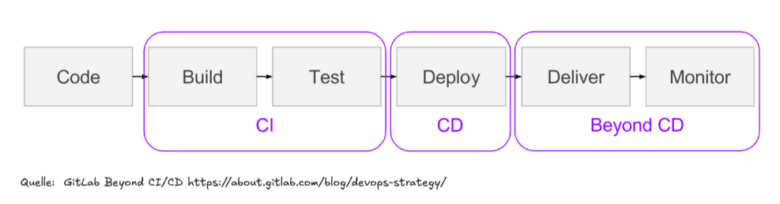

# Übung 2: Einrichtung einer CI/CD-Pipeline

## 1. Einführung in CI/CD

### 1.1 Was ist CI/CD

- stetige weiterentwicklung von Fehlerfreier Software durch:
  - Automatisierte Builds & Tests, welche prüfen, ob der Code funktioniert

- Nach erfolgreichen Tests wird der Code automatisch euf eine Zielumgebung ausgeliefert
  - z.B. Testserver oder produktion

### 1.2 Grundliegende CI/CD Konzepte

- Build Test und Deployment laufen automatisch über Pipelines
- Jeder Commit wird durch Unit-Tests und Integrationstests getestet
- Schritte wie "Build - Test - Deploy" sind klar definiert und reproduzierbar

### 1.3. Wie unterstützt CI/CD unsere Softwareentwicklung

- Änderungen werden sofort geprüft und ausgeliefert
- Automatisierte Tests & Deployments sparen Zeit und reduzieren Fehler
- Alle Teammitglieder sehen den Status der Builds und Deployments
- Durch häufige, kleine Deployments sinkt das Risiko von großen Fehlern

## 2. Einrichtung der CI/CD-Pipeline

### ci.yml Datei erstellen
### Verwendung von GitHub Actions
### Workflow-Übersicht:
 1. Backend bauen und testen (Maven, Spotless, JaCoCo)
 2. Frontend aus backend/src/main/resources/static/ packen
 3. Deployment-Status prüfen und erklären
 4. Auf GitHub Pages deployen (nur bei Push auf main/dev)

 Trigger:
 - Pull Requests gegen main/dev: Tests und Build laufen
 - Push auf main/dev: Tests, Build und Deployment laufen

 Permissions:
 - contents:write für Repository-Zugriff
 - checks:write für Test-Report-Annotationen
 - pull-requests:write für PR-Kommentare mit Test-Ergebnissen
 - pages:write für GitHub Pages Deployment
 - id-token:write für OIDC Token (sichere Authentifizierung)

## 3. Tests hinzufügen

## 4. Deployment-Konzepte

## 5. Branching und Pullrequest in Verbindung mit CI/CD

## 6. Bonus CI-Pipeline erweitern