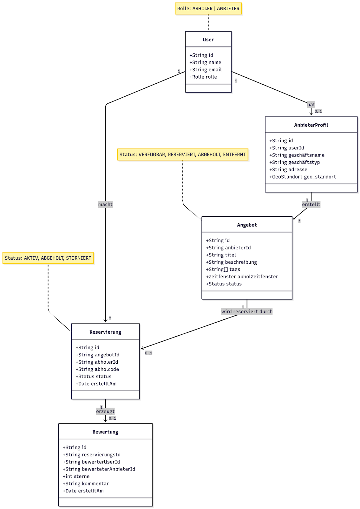
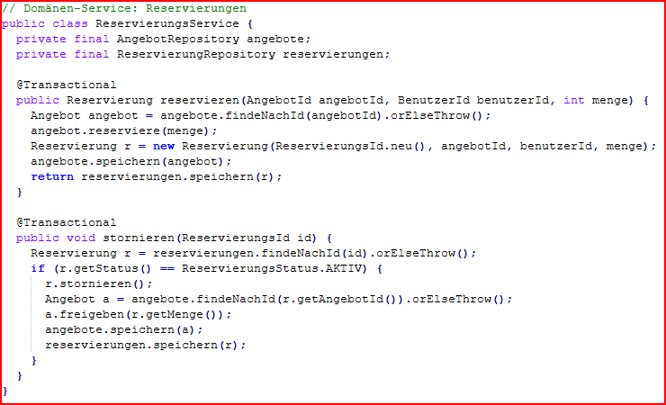
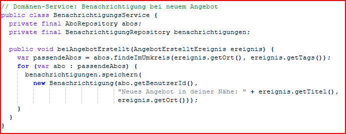

# Übung :3 Systemarchitektur Ihres Projektes modellieren

## 1. Eventstorming durchführen

### Event-Storming Visualisierung über Kollaboratives Board

- **Anbieter registriert:** Ein neuer Anbieter registriert sich im FoodRescue-System
- **Essensangebot erstellen:** Ein neues Essensangebot wird eingestellt
- **Angebot aktualisieren:** Anbieter ändert Informationen zum Angebot
- **Angebot entfernen:** Anbieter entfernt ein Angebot
- **Nutzer registrieren:** Ein neuer Abholer registriert sich im FoodRescue-System
- **Essen reservieren:** Ein Nutzer reserviert sich ein Essensangebot
- **Reservierung stornieren:** Nutzer stornier Reservierung
- **Abholung bestätigen:** Anbieter und Nutzer bestätigen die erfolgte Abholung per Code

## 2. Domänenmodell erstellen 

### 2.1. Kern-Entitäten Allgemein:
- User
- AnbieterProfil
- Angebot
- Reservierung
- Bewertung

### Werte (Value Objects):
- geo_standort
- abholZeitfenster
- abholcode
- tags

### Aggregate:
- User-Aggregat (User + AnbieterProfil)
- Angebot-Aggregat (Angebot + Reservierung)
- Bewertungs-Aggregat (Bewertung)

### 2.2. Kern-Entitäten-Details
- User: id, name, email, rolle (ABHOLER | ANBIETER)
  -    AnbieterProfil: id, userId, geschäftsname, geschäftstyp, adresse, geo_standort (nur wenn User.rolle = ANBIETER)

- Angebot: id, anbieterId, titel, beschreibung, tags, abholZeitfenster, status (VERFÜGBAR, RESERVIERT, ABGEHOLT, ENTFERNT)
- Reservierung: id, angebotId, abholerId, abholcode, status (AKTIV, ABGEHOLT, STORNIERT), erstelltAm
- Bewertung: id, reservierungsId, bewerterUserId, bewerteterAnbieterId, sterne (1-5), kommentar, erstelltAm

### 2.3. Klassendiagramm

Abb. 1: Klassendiagramm nach DDD via Mermaid Chart

## 3. Bounded Contexts identifizieren

**1. Angebotsmanagement**

– Zuständig für die Verwaltung von Angeboten (anlegen/ändern/schließen, Haltbarkeitslogik, Ablauf)

**2. Reservierungsmanagement**

– Zuständig für die Verwaltung von Reservierungen (reservieren/stornieren)

**3. Abholungsmanagement**

– Zuständig für die Verwaltung der Abholungen

**4. Suchmanagement**

– Zuständig für die Verwaltung der Suche (filtern nach Distanz/Tags/Zeitfenster und Sortierung)

**5. Reputationsmanagement**

– Zuständig für die Verwaltung von Bewertungen und Meldungen (schreiben,melden,senden)

Abb. 2: Diagramm zum Bounded Context via Mermaid Chart

## 4. Entitäten und Aggregates definieren

### Userverwaltung

**Entität: User (kann Abholer oder Anbieter sein (oder später beides))**

**Aggregate:**

| Attribute | Methoden |
| :---- | :---- |
| userId: int name: String email: string rolle: enum (Abholer, Anbieter)  | registriereUser(name, email, rolle) aendereRolle(rolle) aendereName(name) aendereEmail(email)  |

**Nur wenn `Rolle == ANBIETER` existiert ein AnbieterProfil.**

**Entität unter User: AnbieterProfil**

**Aggregate:**

| Attribute | Methoden |
| :---- | :---- |
| anbieterProfilId: int userId: int geschaeftsname: String geschaeftstyp: enum adresse: Adresse geoStandort: GeoStandort | erstellenFuerAnbieter(anbieterProfilId,userId,geschaeftsname,geschaeftstyp,adresse,geoStandort) aendereGeschaeftsname(geschaeftsname) aendereGeschaeftstyp(geschaeftstyp) aendereAdresse(adresse) setzeGeoStandort(geoStandort) entferneGeoStandort(geoStandort) |

### Angebotsmanagement

**Entität: Angebot**

**Aggregate:**

| Attribute | Methoden |
| :---- | :---- |
| angebotsId: int anbieterId: int angebotsTitel: string angebotsBeschreibung: string anzahl: int angebotsStatus: string angebotsTag: string angebotsStandort: geoAdress zeitfenster: date  | angebotVeröffentlichen() angebotAktualisieren() angebotReservieren() angebotFreigeben() angebotAbgelaufen() angebotBeenden() |

### Reservierungsmanagement

**Entität: Reservierung**

**Aggregate:**

| Attribute | Methoden |
| :---- | :---- |
| reservierungsId: int angebotsId: int anbieterId: int userId: int angebotsTitel: string angebotsBeschreibung: string anzahl: int reservierungsStatus: string reservierungsTag: string angebotsStandort: geoAdress abholDatum: date  | reservierungAbgeholt() reservierungAktualisieren() reservierungAbgelaufen() reservirungAbgelaufen() |

### Abholungsmanagement

**Entität: Abholung**

**Aggregate:**

| Attribute | Methoden |
| :---- | :---- |
| reservierungsId: int angebotsId: int anbieterId: int userId: int angebotsTitel: string angebotsBeschreibung: string anzahl: int reservierungsStatus: string reservierungsTag: string angebotsStandort: geoAdress abholDatum: date | reservierungAbgeholt() reservierungAktualisieren() reservierungAbgelaufen() reservirungAbgelaufen() |

### Suchmanagment

**Entität: Suche**

**Aggregate:**

| Attribute | Methoden                                           |
| :---- |:---------------------------------------------------|
| angebotsId: int anbieterId: int angebotsTitel: string angebotsBeschreibung: string anzahlVerfügbar: int AngebotsStatus: string angebotsStandort: geoAdress abholDatum: date  | radiusAnpassen() tagHinzufügen() kanalAktivieren() |

### Reputationsmanagement

**Entität: Reputation**

**Aggregate:**

| Attribute | Methoden |
| :---- | :---- |
| reputationsId: int anbieterId: int userId: int angebotsTitel: string reputationsText: string reputationsWert: int | schreibeReputations() meldeMissbrauch() reputationAnbieter() reputationAboler() sendeReputation()  |

## 5. Domain Services und Repositories

### Domänen-Services

* **UserService:**  Registrierung \+ E-Mail-Unique \+ ggf. sofort ANBIETER,  Rollenwechsel & Konsistenz mit AnbieterProfil, Erstellung/Aktualisierung des AnbieterProfils nach Regeln
* **Angebotsservice:** Verantwortlich für das Veröffentlichen, Aktualisieren und Stornieren von Lebensmittel-Angeboten sowie das Auffinden aktiver Angebote in der Nähe und das Auslaufenlassen abgelaufener Angebote.
* **Reservierungsservice**: Verantwortlich für das Reservieren von Angeboten, das Stornieren von Reservierungen, das Bestätigen der Abholung sowie die Durchsetzung von Reservierungsregeln (z. B. maximale Haltedauer, Limit pro Nutzer).
* **Benachrichtigungsservice:** Verantwortlich für das Verwalten von Standort-Abonnements (Subscribe/Unsubscribe) und das Ermitteln von Empfängern, die bei neuen Angeboten im Umkreis benachrichtigt werden sollen.

* **Bewertungsservice:** Verantwortlich für die Verwaltung von Bewertungen für Anbieter oder Angebote, die Berechnung von Durchschnittsbewertungen und die Sicherstellung, dass nur Nutzer bewerten dürfen, die tatsächlich abgeholt haben

### Repository-Schnittstellen

* **UserRepository:** Verwaltet die User

  Methoden:

    * findeMitId(String userId)

      Liefert den User anhand seiner ID

    * speichern(User user)

      Speichert den User

* **AngebotsRepository:** Verwaltet die Lebensmittelangebote.

  Methoden:

    * findeAngebotNachId(String angebotsId)

  Liefert ein bestimmtes Angebot anhand seiner ID.

    * speichereAngebot(Angebot angebot)

  Fügt ein neues Angebot hinzu oder aktualisiert ein bestehendes.

    * loescheAngebot(String angebotsId)

  Entfernt ein Angebot aus dem System.

    * findeAktiveAngeboteImUmkreis(Koordinaten position, double radiusKm, Zeitpunkt jetzt, int limit)

      Liefert aktive (nicht abgelaufene) Angebote in einem bestimmten Umkreis.

    * findeAngeboteNachAnbieter(String anbieterId, String status, int anzahl)

      Findet Angebote eines bestimmten Anbieters

* **ReservierungsRepository:** Verwaltet die Reservierungen.

  Methoden:

    * findeReservierungNachId(String reservierungsId)

  Liefert eine bestimmte Reservierung anhand ihrer ID.

    * speichereReservierung(Reservierung reservierung)

  Legt eine neue Reservierung an oder aktualisiert eine bestehende.

    * findeAktiveReservierungenNachNutzer(String nutzerId)

  Liefert alle aktuell gültigen Reservierungen eines Nutzers.

    * zaehleAktiveReservierungenNachNutzer(String nutzerId)

  Gibt die Anzahl der aktiven Reservierungen eines Nutzers zurück.

* **BenachrichtigungenRepository:** Verwaltet Standort-Abonnements, mit denen Nutzer über neue Angebote in der Nähe informiert werden.

  Methoden:

    * speichereAbonnement(Abonnement abonnement)

  Legt ein neues Standort-Abonnement an oder aktualisiert es.

    * loescheAbonnementsNachNutzer(String nutzerId)

  Entfernt alle Abonnements eines bestimmten Nutzers.

    * findeAbonnementsImUmkreis(Koordinaten position, double radiusKm)

      Liefert alle Abonnements, die für ein Angebot im angegebenen Umkreis relevant sind.

* **NutzerRepository:** Verwaltet nutzerbezogene Daten und prüft fachliche Bedingungen, z. B. für Reservierungen.

  Methoden:

    * existiertNutzer(String nutzerId)

  Prüft, ob ein Nutzer im System vorhanden ist.

    * findeNutzerNachId(String nutzerId)

  Liefert die Stammdaten eines bestimmten Nutzers.

    * zaehleAktiveReservierungen(String nutzerId)

      Gibt die Anzahl der derzeit aktiven Reservierungen eines Nutzers zurück.

* **AnbieterRepository:** Verwaltet die Anbieter (Restaurants, Supermärkte, Privatpersonen), die Lebensmittel einstellen.

  Methoden:

    * existiertAnbieter(String anbieterId)

  Prüft, ob ein Anbieter im System vorhanden ist.

    * istAnbieterVerifiziert(String anbieterId)

  Prüft, ob der Anbieter verifiziert ist (z. B. Restaurant oder Markt).

    * findeAnbieterNachId(String anbieterId)

  Liefert die Stammdaten eines bestimmten Anbieters.

* **BewertungsRepository:** Verwaltet Bewertungen von Nutzern über Anbieter oder Angebote.

  Methoden:

    * findeBewertungNachId(String bewertungsId)

  Liefert eine bestimmte Bewertung anhand ihrer ID.

    * speichereBewertung(Bewertung bewertung)

  Fügt eine neue Bewertung hinzu oder aktualisiert sie.

    * findeBewertungenNachAnbieter(String anbieterId)

  Liefert alle Bewertungen eines Anbieters.

    * findeBewertungenNachNutzer(String nutzerId)

  Liefert alle Bewertungen, die ein Nutzer abgegeben hat.

    * berechneDurchschnittsbewertung(String anbieterId)

  Ermittelt die durchschnittliche Bewertung eines Anbieters.

## 6. Implementierungsstrategie 

### Technische Annahmen

* Backend: Java, Maven, Spring Boot, Tests mit JUnit, DB: Postgres o.Ä.

* Frontend: zunächst: HTML, JavaScript/Typescript, später: Vite oder React

* CI/CD: GitHub Actions (Build \+ Test \+ Deployment auf GitHub Pages).

### Die Implementierungsstrategie umfasst die folgenden Schritte:

1. Entitäten und Aggregate umsetzen: Jede Entität wird als separate Java-Klasse implementiert. Diese Klassen sollen alle Attribute und Methoden enthalten, die zur Verarbeitung von Geschäftslogik und Beziehungen erforderlich sind. Hier dürfen keine Framework-Abhängigkeiten eingebaut werden.

2. Domain Services umsetzen: Für jeden Domain Service wird eine Service-Klasse erstellt, die die Geschäftslogik implementiert. Diese Services arbeiten eng mit den Repositories zusammen, um die Persistenz der Entitäten zu gewährleisten.

3. Repositories umsetzen: Jedes Repository wird als Interface definiert, das Methoden zur Speicherung und zum Abrufen von Entitäten bietet. Sie können auf JPA/Hibernate oder eine andere Persistenz-Lösung zurückgreifen.

4. Erstellen von Domänen Events (z.B. AngebotErstellt oder ReservierungErstellt) und asynchronen Listenern für die Benachrichtigungen.

5. Tests: Unit-Test und Integrationstest.

### Codebeispiele:

