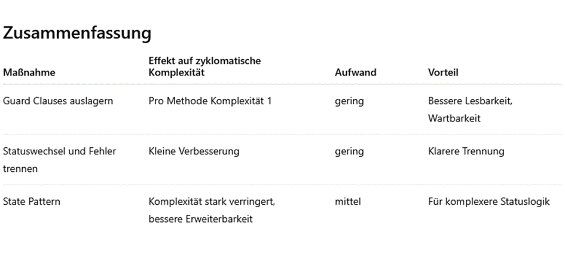
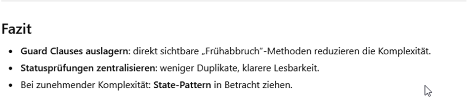
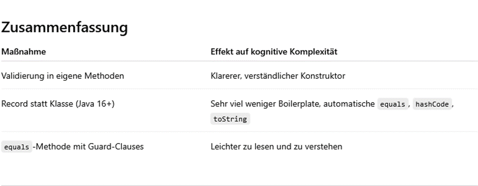
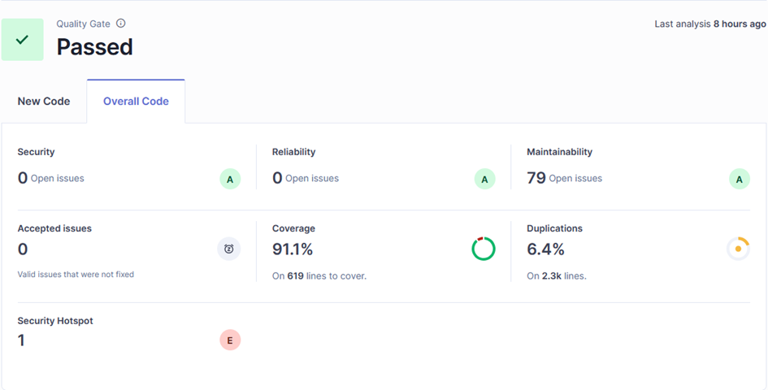
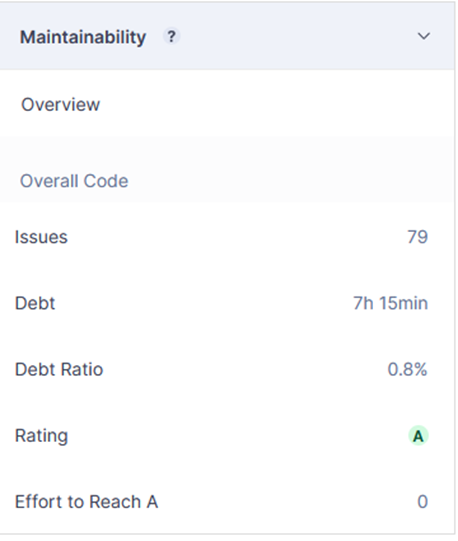
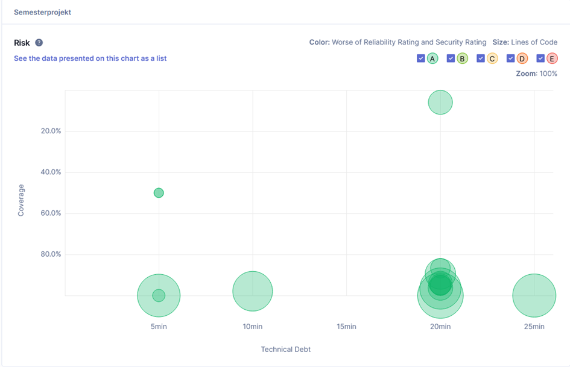
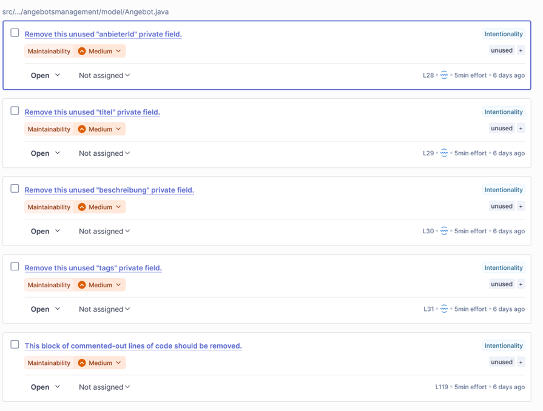
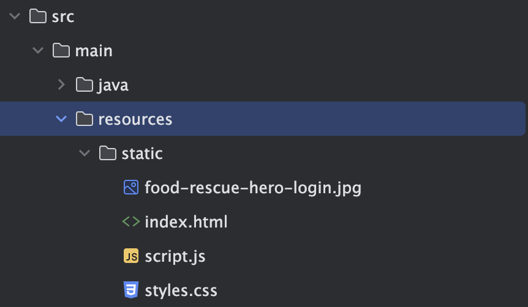
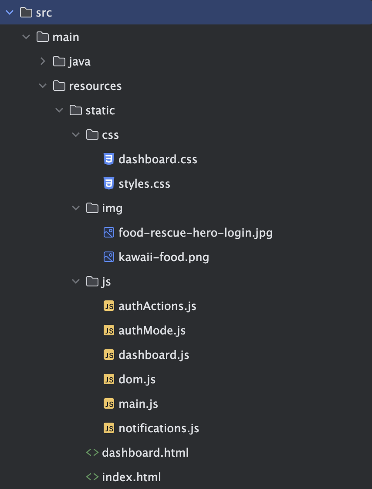

# Übung 5: Software- und Architekturmetriken für Codequalität und Architekturoptimierung

## 1. Überblick und Anwendung einfacher Metriken

Für die Aufgabe wurde aufgrund des Vortrages des Teams 8 SonarQube gewählt, da dieses Tool auf in der Aufgabe 3 benötigt wird.
Die Installation verlief in meinem Umfeld nicht reibungsfrei und die endgültige Lösung des Problems, dass sich SonarQube nicht mit IntelliJ IDEA verbinden ließ, wurde erst durch eine VM mit kompletter, sauberer Installation gelöst.
Nachdem ich hier SonarQube lauffähig bekommen habe, konnte ich dies auch in meine eigentliche Umgebung lauffähig bekommen.
Die Analyse des Codes mit SonarQube zeigte einige interessante Metriken auf.
Die wichtigsten Metriken sind:

### McCabe-Metrik (Zyklomatische Komplexität)

| Wert    |                Bedeutung                |
| :------ | :-------------------------------------: |
| 1–10    |   Einfacher Eingriff, geringes Risiko   |
| 11–20   |       Komplexes, mittleres Risiko       |
| 21–50   |          Komplex, hohes Risiko          |
| &gt; 50 | Nicht testbarer Code, sehr hohes Risiko |

Daher wurden einige Klassen näher betrachtet, welche einen Wert größer als 10 hatten, und im Rahmen der Übung hierzu Empfehlungen via LLM eingeholt.

#### Klasse Abholung.java – Wert 13

Empfehlung zur Reduzierung der Komplexität:

1. Guard Clauses auslagern in private Validierungsmethoden.
2. Statuswechsel und Fehlermeldungen trennen
3. (Optional) State Pattern für Statuslogik



#### Klasse Angebot.java – Wert 16

Die Klasse Angebot hat aktuell keine sehr komplexen Methoden – die zyklomatische Komplexität entsteht primär durch die if-Bedingungen in veroeffentlichen() und reservieren().

Empfehlung zur Reduzierung der Komplexität:

1. Guard Clauses / Validierungs-Methoden auslagern
2. Statuslogik in ein State Pattern auslagern (bei wachsender Domain)
3. Statuswechsel in eigene Methoden kapseln
4. Validierung und Erstellung trennen


#### Klasse Reservierung.java – Wert 15

Empfehlung zur Reduzierung der Komplexität:

1. Guard Clauses auslagern in eigene Validierungsmethoden
2. Statusprüfung zentralisieren
3. (Optional) Status-Logik ins State-Pattern auslagern



### Kognitive Komplexität

Die kognitive Komplexität misst, wie schwer es für einen Entwickler ist, den Code zu verstehen. Sie berücksichtigt dabei nicht nur die Anzahl der Verzweigungen, sondern auch deren Verschachtelungstiefe und die Art der Kontrollstrukturen.
Als Faustregel gilt, dass die Werte für die kognitive Komplexität unter 15 liegen sollten.

Der höchste Wert von 7 wurde in der Klasse GeoStandort.java erzielt. Alle anderen Klassen lagen darunter.


Als Möglichkeiten zur Reduzierung wurde vom LLM folgendes vorgeschlagen:

1. Validierung in eigene Methoden auslagern
2. Optional: equals und hashCode mit Objects.equals vereinfachen



## 2. Test Coverage erweitern und Code Coverage verbessern

### Zielsetzung
Ziel dieses Arbeitsschritts war es, die **Testabdeckung der FoodRescue-Anwendung gezielt zu erhöhen**, um eine höhere **Code-Qualität und Stabilität** der zentralen Logikkomponenten sicherzustellen.  
Mithilfe von **JaCoCo** wurde die aktuelle Testabdeckung gemessen, Lücken identifiziert und anschließend durch gezielte Unit- und Integrationstests geschlossen.

#### Eingesetzte Tools
| Tool | Zweck |
|------|-------|
| **JUnit 5** | Schreiben und Ausführen der Unit-Tests |
| **Mockito** | Mocking von Abhängigkeiten (Repositories, Services) |
| **Spring Boot Test** | Integrationstests der REST-Schicht |
| **JaCoCo** | Ermittlung und Reporting der Test Coverage |
| **IntelliJ Coverage View | Visualisierung der Abdeckungsergebnisse |

### Vorgehensweise

#### Code Coverage analysieren und Prompts für das LLM erstellen
- in IntelliJ wurden alle Testklassen über "Run all Tests with Coverage" laufen gelassen und analysiert
- beim Ergebnis wurde anschließend geschaut welche Klassen und Methoden noch nicht zu mindestens 80 % abgedeckt waren
- dem LLM, in dem Fall ChatGPT 5.1, wurden die Klassen dann gegeben mit dem Prompt für eine 100 prozentige Testabdeckung zu sorgen und ggf. zusätzlich Edge Cases zu erstellen
- die durch das LLM erstellten Testklassen wurden zusätzlich geprüft und teilweise um Logik erweitert

#### Kritische Klassen wurden priorisiert
Die folgenden Bereiche wurden als **qualitätskritisch** eingestuft:
| Ebene | Begründung |
|--------|-------------|
| `FoodREscueApplication` | Zentrale Geschäftslogik
| `Repositories` | Datenhaltung, Validierung von Such- und Speicherlogik |
| `REST-Controller` | Schnittstelle zur Außenwelt, Mapping von Fehlern und Validierungen |
| `Value Objects` | Enthalten Validierungsregeln und sind Teil des Domain Models |

#### 🔹 Domain / Value Objects
- Tests für ungültige Eingaben (`null`, leere Strings, zu lange Werte)
- Tests für korrekte `equals()`- und `hashCode()`-Implementierungen

#### 🔹 REST Controller
- MockMvc-Tests für:
- **404 Not Found** (Profil/User existiert nicht)
- **400 Bad Request** (ungültige Request-Payload)
- Korrekte `Content-Type`- und `Status`-Antworten

#### 🔹 Repository (In-Memory)
- Sicherstellung, dass bestehende IDs überschrieben werden
- Paralleles Speichern (Thread-Sicherheit)


### JaCoCo Quality Gate wurde aktiviert
Um dauerhaft eine Mindestabdeckung zu gewährleisten, wurde das **Quality Gate** in der `pom.xml` konfiguriert:

```xml
<execution>
  <id>check</id>
  <phase>verify</phase>
  <goals>
    <goal>check</goal>
  </goals>
  <configuration>
    <rules>
      <rule>
        <element>BUNDLE</element>
        <limits>
          <limit>
            <counter>INSTRUCTION</counter>
            <value>COVEREDRATIO</value>
            <minimum>0.80</minimum>
          </limit>
          <limit>
            <counter>BRANCH</counter>
            <value>COVEREDRATIO</value>
            <minimum>0.70</minimum>
          </limit>
        </limits>
      </rule>
    </rules>
  </configuration>
</execution>
```

## 3. Technical Debt und Regelverletzungen mit LLM analysieren

Nach der Analyse mit SonarQube ergab sich folgendes aktuelles Bild.



Wie in der Übersicht zu sehen ist, wurden 79 Issues gefunden. Die Duplikation wird mit 6,4% angegeben.
Für die Behebung der gefundenen Issues, wird von SonarQube eine Gesamtdauer von 7h15min für die Behebung angegeben. Die Debt Ratio liegt bei 0.8, was zu einem Gesamtrating von A führt.



Das Risiko und die Wartbarkeit der Anwendung ist daher als sehr gut anzusehen., was in den beiden Übersichten erkenntlich ist.




Hier ist für die Klasse Angebot.java einmal die Übersicht zur Behebung des technical debt angegeben.




## 4. Frontend-Entwicklung und Erweiterung der Anwendung

Das Frontend der FoodRescue-Anwendung besteht aus zwei Hauptseiten

- `index.html` für Login/Registrierung und
- `dashboard.html` für eingeloggte User

Es wird eine modulare JavaScript-Architektur mit separaten Modulen für Authentifizierung, DOM-Manipulation und Benachrichtigungen eingesetzt:

- `main.js` - Haupteinstiegspunkt der Anwendung
- `authActions.js` - Authentifizierungs-Logik für Login/Registrierung
- `authMode.js` - Verwaltung des Authentifizierungsmodus (Login/Registrierung)
- `dom.js` - DOM-Manipulation und Element-Referenzen
- `notifications.js` - Anzeige von Fehler- und Erfolgsmeldungen
- `dashboard.js` - Dashboard-Funktionalität und Logout

### Zusammenspiel Frontend und Backend

Die zentrale Backend-Funktionalität der Userverwaltung wird über die REST-API `/api/users` (POST-Methode) angesprochen, damit eingegebene Daten serverseitig validiert werden können, für Testzwecke werden die Daten jedoch noch nicht persistent gespeichert, sondern im `localStorage` abgelegt. Das Dashboard zeigt aktuell statische Informationen (Abholtermine, Navigationspunkte) an, um später weitere Backend-Services wie Angebotsmanagement und Reservierungsverwaltung über entsprechende API-Endpunkte anzubinden.

## 5. Reflexion zum Einsatz von Metriken und LLM

### LLM & Frontendentwicklung

Beim Einsatz des LLM für die Frontendentwicklung zeigte sich, dass ohne klare Instruktionen zunächst eine einzige `script.js`-Datei mit mehreren hundert Zeilen entstand, die kaum wartbar war und zudem keinerlei Verzeichnisstruktur für CSS oder Bildressourcen vorsah.


_Initialie Frontend-Ordner Struktur des LLMs_

Erst durch gezieltes Prompting hin zu einer modularen Struktur mit klaren Verantwortlichkeiten, separaten Ordnern (`css/`, `img/`) und erläuternden Kommentaren wurde der Code übersichtlicher und besser erweiterbar. Die Erfahrung unterstreicht, wie wichtig klare Vorgaben an das LLM sind, um maintainable Ergebnisse zu erhalten, die keine technischen Schulden erzeugen.


_Optimierte Frontend-Ordner Struktur nach gezielten Prompts_

Darüber hinaus generierte das LLM wiederholt fehlerhafte SVG-Bider, nutzte unharmonische Farbkombinationen und produzierte Positionierungs Probleme bei einigen Elementen (z. B. Überlappungen). Diese Aspekte mussten manuell nachgebessert werden, indem z.B. Farbpaletten definiert, auf spezifische Elemente angepasst und vereinheitlicht wurde und Elemente gezielt nachpositioniert wurden. Auch hier zeigte sich, dass UI/UX-Feinheiten ohne konkrete Vorgaben kaum in ausreichender Qualität geliefert werden.
